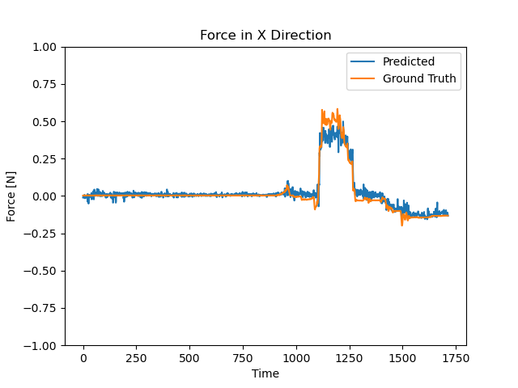
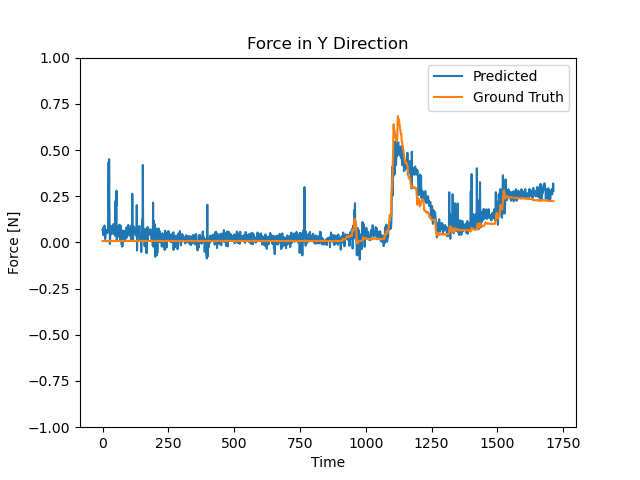

# Visual Force Estimation for Robotic Surgery 

## Introduction

This project is part of a research initiative on force-aware imitation learning algorithms for robotic surgery at the CHARM Lab at Stanford University. The primary goal is to develop neural network models capable of predicting forces and torques exerted during robotic surgery using only visual input and robot state information.

## Project Overview

The project implements and evaluates several deep learning models for force estimation in robotic surgery:

1. Vision Robot Network (VRN): A model that combines visual and robot state data to predict forces.
2. Robot State Transformer: A transformer-based model that processes sequences of robot state data for force prediction.
3. Autoencoder: Used for dimensionality reduction and feature extraction from surgical images.

## Installation

1. Clone the repository:

   ```
   git clone https://github.com/your-username/visual-force-estimation.git
   cd visual-force-estimation
   ```

2. Create and activate the Conda environment:
   ```
   conda env create -f env.yml
   conda activate force_estimation
   ```

## Usage

### Training Models

The project includes shell scripts to simplify the training process for different model types. These scripts set up the appropriate parameters and run the training for each model.

1. Vision Robot Network:
   Use the `train_nn.sh` script to train the Vision Robot Network:

   ```
   ./train_nn.sh
   ```

   This script sets up parameters such as batch size, learning rate, number of epochs, and which runs to use for training. It then calls `train.py` with these parameters.

2. Robot State Transformer:
   Use the `train_transformer.sh` script to train the Robot State Transformer:

   ```
   ./train_transformer.sh
   ```

   This script configures the transformer-specific parameters like sequence length and state type, in addition to general training parameters. It then executes `train_transformer.py`.

3. Autoencoder:
   The autoencoder training is typically included in the `main.sh` script. To train the autoencoder, set the `TRAIN_AUTOENCODER` flag to true in `main.sh` and run:
   ```
   ./main.sh
   ```

Each of these scripts can be modified to adjust hyperparameters or dataset selections as needed.

### Evaluating Models

To evaluate a trained model:

```
python evaluate.py --weights <path_to_weights> --run <run_number> --model res_net --model_type <vision_robot/transformer> --use_acceleration --state <model_state>
```

The evaluation script performs the following:

- Loads the specified model and weights
- Runs the model on the test dataset
- Computes performance metrics (e.g., RMSE)
- Generates and saves plots comparing predicted forces to ground truth
- Saves the results as plot images in the `plots/` directory

These plots provide a visual representation of the model's performance, showing how well the predicted forces align with the actual forces over time.

### Hyperparameter Search

To perform a hyperparameter search for the transformer model:

```
python hyperparam_search.py
```

This script systematically explores different combinations of hyperparameters to find the optimal configuration for the transformer model.

## Data

The project uses a custom dataset of robotic surgery recordings, including:

- Robot state information (joint positions, end-effector positions, etc.)
- Stereo camera images from the surgical scene
- Ground truth force measurements

## Results

These plots showcase the performance of our transformer-based model, which demonstrated the best results among all tested approaches. The model exhibits remarkable accuracy in predicting force values for demonstrations it has encountered during training, as evidenced by the close alignment between predicted (blue) and ground truth (orange) lines. However, it's important to note that the model faces challenges in generalizing to entirely new scenarios.

  <p align="center">
      
       
    </p>
    <p align="center">
      <em>Predicted vs Ground Truth force values for the X- and Y-axis during a complete surgical operation sequence</em><br>
    </p>

## Acknowledgments

This project is part of research conducted at the CHARM Lab at Stanford University.

## Contact

For questions or further information, please contact me at rtim@stanford.edu.
